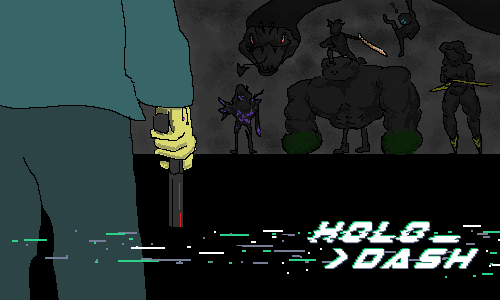

## Final Stretch

#### 02/28/2023

We are nearing the end of our journey here at the HoloDash Team, and we are putting in as much work as possible into polishing our game. This week, we've been hard at work implementing what we promised you last week. That includes:

- Updated looks for levels, enemies, the upgrade station, and the bosses.
- New augments
- New levels

In addition, we have a couple of new Key Visuals to share with you, here's one of them.

We also have an updated trailer for you, this time with gameplay! (The thumbnail is another new KV :D)

  <iframe
    width="853"
    height="480"
    src="https://www.youtube.com/embed/gXC5I4UZ-48"
    frameBorder="0"
    allow="accelerometer; autoplay; clipboard-write; encrypted-media; gyroscope; picture-in-picture"
    allowFullScreen
    title="Embedded youtube"
  > </iframe>

We'll be at the CSE 481D Games Capstone Convention/ Demo Day on March 9th From 10:00AM to 11:30AM. Hope to see you there.

Sincerely,

The HoloDash Team