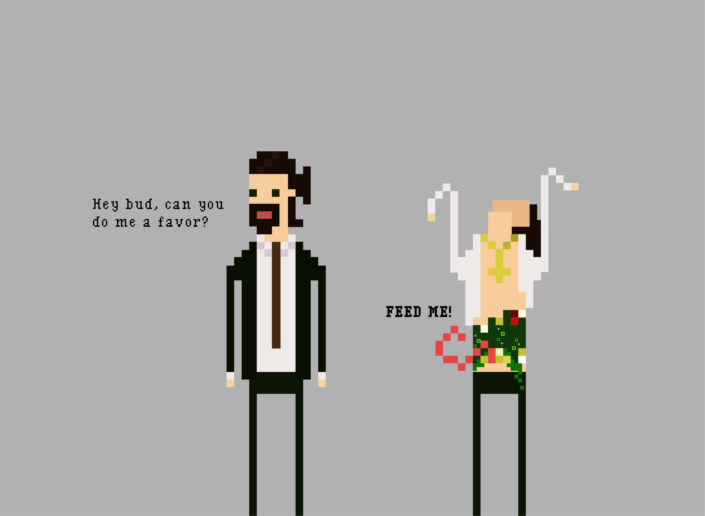

## Welcome to Aelos

#### 01/13/2023

Notice anything different? That's right, HoloDash has a logo!

In addition to our logo, we've also been looking at the art direction for the game. We are carefully crafting and curating the visual style of HoloDash to ensure that it is not only aesthetically pleasing, but also true to the game's storyline. We are taking great care to make sure that the art direction is cohesive and consistent throughout the game. We don't have it down to a tee yet, but here's something to look forward to in the meantime.

*Feel the <ins>wrath</ins> of these enemies.*

We're also refining the story behind our game. Welcome to Aelos, the city of unity. Aelos is a city built by Visonine, a megacorporation that has its reach in all crevices of the city. No system runs without Visonine. Working for Visionine is something anyone would be *lustful* for. But don't be *envious*, soon you will become the employee of the year!

We know you're *hungry* for more, but don't be *greedy* now, stay alert, don't fall *asleep*. And we'll see you soon.

With *pride*,

The HoloDash Team